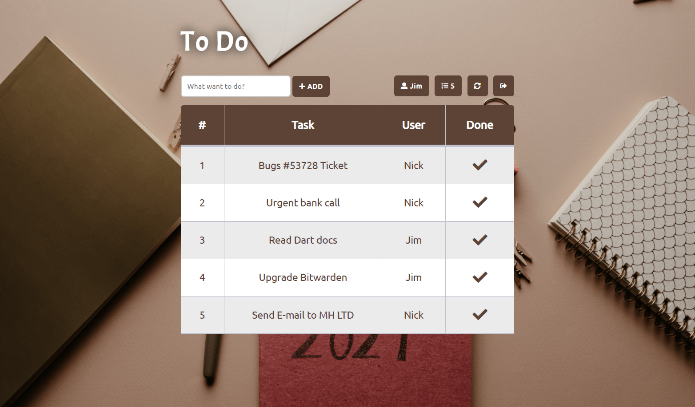

# To Do
A web application where you can **add tasks** and **mark tasks as done**. To do this you need to **login** or to **create an account**. All data are stored in a MySQL database.

## Technologies & Programming Languages
- PHP
- JavaScript/jQuery
- AJAX
- MySQL
- HTML
- CSS
- Fontawesome Icons

## Programs & Management
- Visual Studio Code
- MySQL Workbench
- phpMyAdmin
- GitHub Desktop
- Git
- Heroku Cloud

## URLs
**Public GitHub Repository:** [github.com/diminaso-uowm/to-do](https://github.com/diminaso-uowm/to-do)<br>
**Private GitHub Repository:** [github.com/diminaso-uowm/to-do-dev](https://github.com/diminaso-uowm/to-do-dev)<br>
**Demo (Heroku Cloud):** [to-do-preview.herokuapp.com](https://to-do-preview.herokuapp.com)

## Installation
To **install** and **run** this application in your computer you should at least have:
- Code Editor (f.e. Visual Studio Code)
- MySQL Server (local or remote)
- Database Manager - Client (HeidiSQL, etc)

Cloud Alternative: Install it at [Heroku Cloud](https://www.heroku.com)

In your database manager (GUI or CLI) make a **new database** with name **to-do**.

Create a new table with name **users** with the bellow columns:
- **id** (INT, PK, AI)
- **username** (VARCHAR 100, NN)
- **email** (VARCHAR 100, NN)
- **password** (VARCHAR 100, NN)

Script:
```
CREATE TABLE `to-do`.`users` (
`id` INT NULL AUTO_INCREMENT,
`username` VARCHAR(100) NOT NULL,
`email` VARCHAR(100) NOT NULL,
`password` VARCHAR(100) NOT NULL,
PRIMARY KEY (`id`),
UNIQUE INDEX `id_UNIQUE` (`id` ASC));
```

Create a new table with name **list** with the bellow columns:
- **id** (INT, PK, AI)
- **task** (VARCHAR 50, NN)
- **user** (VARCHAR 100, NN)

Script:
```
CREATE TABLE `to-do`.`list` (
`id` INT NOT NULL AUTO_INCREMENT,
`task` VARCHAR(50) NOT NULL,
`user` VARCHAR(100) NOT NULL,
PRIMARY KEY (`id`));
```

Last step is to update **config.php** file with your **database connection details**:

```
$host = "HOST";
```
```
$db_username = "DATABASE_USERNAME";
```
```
$database = "DATABASE_NAME";
```
```
$db_password = "DATABASE_PASSWORD";
```

## Screenshots




## License
This project released under the [MIT](https://github.com/diminaso-uowm/to-do/blob/main/LICENSE) license.